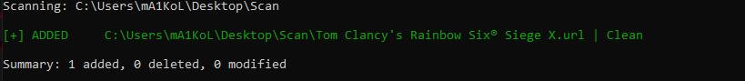

# VirusTotal File Integrity Checker

This script scans a directory, calculates SHA-256 hashes for all files, and checks for unexpected changes. New or modified files are looked up using the VirusTotal API to identify potential threats.

## Features
- Tracks file additions, deletions, and changes
- Sends hashes to VirusTotal for reputation scoring
- Resolves Windows `.lnk` shortcut targets
- Saves trusted hash database locally (`trusted_hashes.json`)
- Works on Windows, Linux, and macOS

## Setup
```bash
pip install -r requirements.txt
cp .env.example .env   # insert your VirusTotal API key


